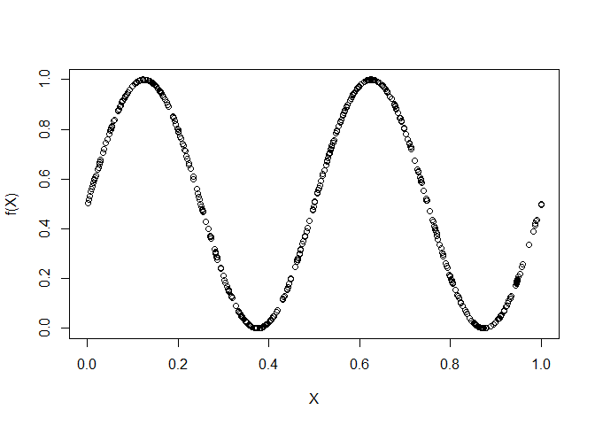

<!-- README.md is generated from README.Rmd. Please edit that file -->

# RDM – Rearranged dependence measures

<!-- badges: start -->

[](https://github.com/ChristopherStrothmann/RDM/actions/workflows/R-CMD-check.yaml)

<!-- badges: end -->

The R-Package RDM (rearranged dependence measures) computes the directed
dependence between random variables $X$ and $Y$ building upon classical
dependence measures such as Spearman’s $\rho$, Kendall’s $\tau$ or even
measures of complete dependence such as Dette-Siburg-Stoimenov’s $r$ and
Chatterjee’s $\xi$.

The rearranged dependence measure $R_\mu$ of some underlying dependence
measure $\mu$ fulfils

1.  $R_\mu(X, Y) \in [0, 1]$,

2.  $R_\mu(X, Y) = 0$ if and only if $X$ and $Y$ are independent,

3.  $R_\mu(X, Y) = 1$ if and only if $Y = f(X)$ for some (not
    necessarily affine or monotone) function $f$.

Crucially, while underlying measures such as $\rho$ or $\tau$ are unable
to precisely detect independence and functional dependence, the employed
rearrangement technique improves these deficiencies of the underlying
measures.

For more information on the theoretical properties of $R_\mu$ and a
discussion of the employed estimator $\widehat{R}_\mu$, see Strothmann,
Dette, and Siburg (2022) and Strothmann (2021).

## Installation

You can install the development version of RDM via:

``` r
# install devtools package
if (!requireNamespace("devtools", quietly = TRUE)) {
  install.packages("devtools")
}
# install package
devtools::install_github("https://github.com/ChristopherStrothmann/RDM", dependencies = TRUE)
```

## Examples

Let us first illustrate the basic usage of the RDM-Package

``` r
library(RDM)

n <- 500
x1 <- runif(n)
X <- cbind(x1, 0.5*sin(4*pi*x1)+0.5)
plot(X, xlab="X", ylab="f(X)")
```



``` r

#Computes R_mu(X, Y) using Spearman's rho as the underlying measure 
#and a fixed bandwidth 500^(0.5) of the underlying copula estimator
rdm(X, method="spearman", bandwidth_method="fixed", bandwidth_parameter = 0.5)
#> [1] 0.9811719

#Comparison to the Spearman's rho
cor(X[, 1], X[, 2], method="spearman")
#> [1] -0.3248678

#Computes R_mu(X, Y) using all implemented underlying measures
results <- rdm(X, method="all", bandwidth_method="fixed", bandwidth_parameter = 0.5)
#Value for Spearman's rho
results$spearman
#> [1] 0.9811719
#Value for Kendall's tau
results$kendall
#> [1] 0.8719117
#Value for Blum-Kiefer-Rosenblatt R (or Schweizer-Wolff sigma_2)
results$bkr
#> [1] 0.9768168
#Value for Dette-Siburg-Stoimenov r (or Chatterjee's xi)
results$dss
#> [1] 0.8237094
#Value for Trutschnig's zeta_1
results$zeta1
#> [1] 0.9039916
```

Please note that the choice of bandwidth $s \in (0, 0.5)$ is crucial for
the speed of convergence towards the true value $R_\mu(X, Y)$. Generally
speaking, smaller values of $s$ are more advantageous in case of "almost
independent" random variables $X$ and $Y$, whereas larger values of $s$
improve the convergence rate for dependent random variables $X$ and $Y$.
The RDM-Package provides a cross-validation approach for the bandwidth
choice:

``` r
library(RDM)

n <- 500
x1 <- runif(n)
X <- cbind(x1, 0.5*sin(4*pi*x1)+0.5)

#Use a cross-validation principle to determine appropriate bandwidth choices
rdm(X, method="spearman", bandwidth_method="cv", bandwidth_parameter = c(0.25, 0.5))
#> [1] 0.975702
```

## References

<div id="refs" class="references csl-bib-body hanging-indent">

<div id="ref-Strothmann.2021" class="csl-entry">

Strothmann, C. 2021. “Extremal and Functional Dependence Between
Continuous Random Variables.” Dissertation, TU Dortmund.
<https://doi.org/10.17877/DE290R-22733>.

</div>

<div id="ref-Strothmann.2022" class="csl-entry">

Strothmann, C., H. Dette, and K. F. Siburg. 2022. “Rearranged Dependence
Measures.” <https://arxiv.org/abs/2201.03329>.

</div>

</div>

## Copyright

This package uses a modified version of code.cpp from the R-package
“qad”, version 1.0.4, available under the GPL-2 license at
<https://cran.r-project.org/package=qad>. For more information see the
file “DESCRIPTION” and for a list of incorporated changes, please refer
to src/code.cpp.
